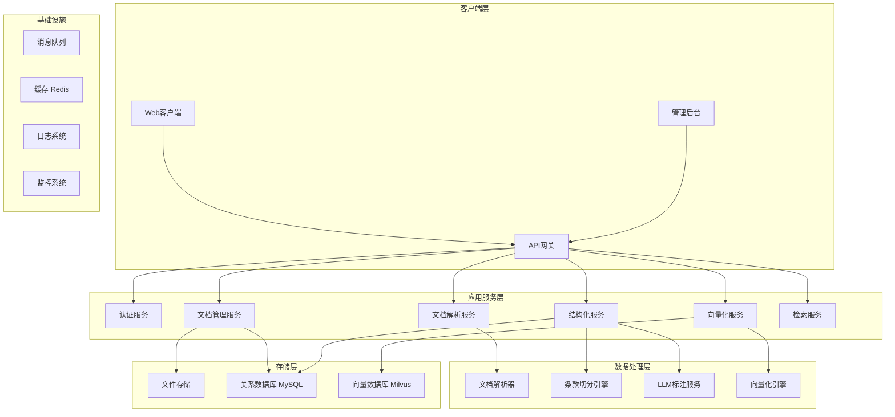
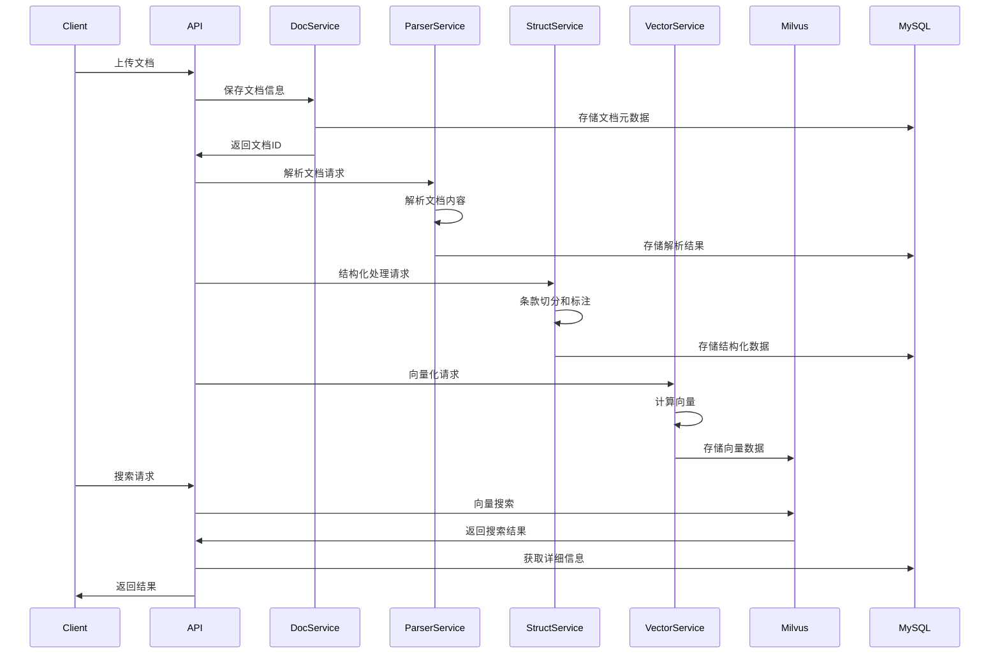

# 法务数据结构化系统架构设计

## 系统概述

本系统旨在实现法务文档的结构化处理，将原始合同文档转换为章→条→子项→正文段的树形结构，并提供向量化、检索和回溯功能。

## 系统架构

## 技术栈选择

### 后端服务
- **框架**: Python + FastAPI (高性能、自动API文档、类型提示)
- **微服务架构**: 使用Docker容器化部署
- **异步处理**: Celery + Redis 处理耗时任务
- **API文档**: 自动生成OpenAPI文档

### 数据存储
- **关系数据库**: MySQL 8.0 (存储结构化数据)
- **向量数据库**: Milvus 2.3 (存储向量和元数据)
- **文件存储**: MinIO (兼容S3的对象存储)
- **缓存**: Redis (会话、缓存)

### 文档处理
- **PDF处理**: PyMuPDF (fitz)
- **DOCX处理**: python-docx
- **TXT/MD/HTML处理**: 自定义解析器
- **OCR服务**: PaddleOCR (处理扫描件)

### AI与机器学习
- **文本向量化**: 
  - OpenAI Embeddings API (text-embedding-3-large)
  - 本地模型: text2vec-large-chinese
- **LLM标注**: OpenAI GPT-4 / Claude API
- **条款识别**: 自定义规则模型 + LLM

### 部署与运维
- **容器化**: Docker + Docker Compose
- **编排**: Kubernetes (生产环境)
- **CI/CD**: GitLab CI/CD
- **监控**: Prometheus + Grafana
- **日志**: ELK Stack (Elasticsearch + Logstash + Kibana)

## 核心服务设计

### 1. 文档管理服务
- 文档上传、存储、版本管理
- 文档格式验证和预处理
- 文档生命周期管理

### 2. 文档解析服务
- 多格式文档解析
- 文档结构提取
- 文本块生成

### 3. 结构化服务
- 基于规则的条款切分
- LLM辅助的条款标注
- 层次结构构建

### 4. 向量化服务
- 文本预处理
- 向量计算
- 向量库管理

### 5. 检索服务
- 语义搜索
- 相似度计算
- 结果聚合和排序

## 数据流程

## 性能与扩展性考虑

### 1. 性能优化
- 异步处理耗时任务
- 数据库索引优化
- 向量索引优化(HNSW)
- 缓存策略

### 2. 扩展性设计
- 微服务架构
- 水平扩展能力
- 消息队列解耦
- 分片策略

### 3. 高可用性
- 服务冗余
- 数据备份
- 故障转移
- 健康检查

## 安全性设计

### 1. 数据安全
- 数据加密存储
- 传输加密(HTTPS/TLS)
- 访问控制
- 数据脱敏

### 2. 系统安全
- 身份认证
- 权限管理
- API限流
- 审计日志

## 开发与部署计划

### 阶段一：基础框架 (1-2周)
- 搭建基础项目结构
- 配置开发环境
- 实现基础API框架
- 数据库设计和初始化

### 阶段二：核心功能 (2-3周)
- 实现文档上传和管理
- 实现文档解析功能
- 实现条款切分和结构化
- 实现向量化功能

### 阶段三：高级功能 (1-2周)
- 实现搜索和检索
- 实现业务标签功能
- 性能优化
- 单元测试

### 阶段四：部署上线 (1周)
- 容器化配置
- CI/CD配置
- 生产环境部署
- 监控和日志配置